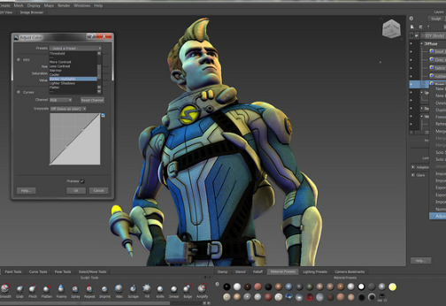
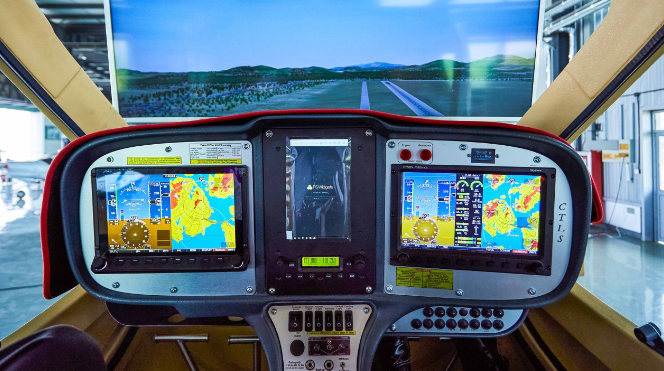
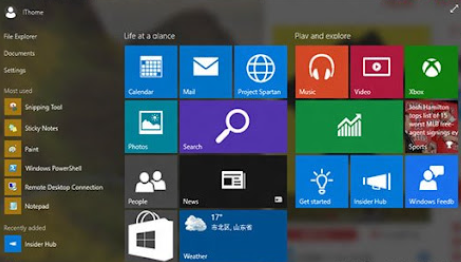
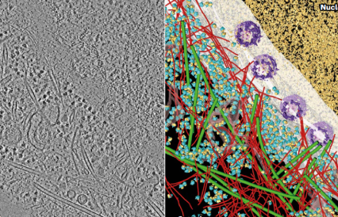
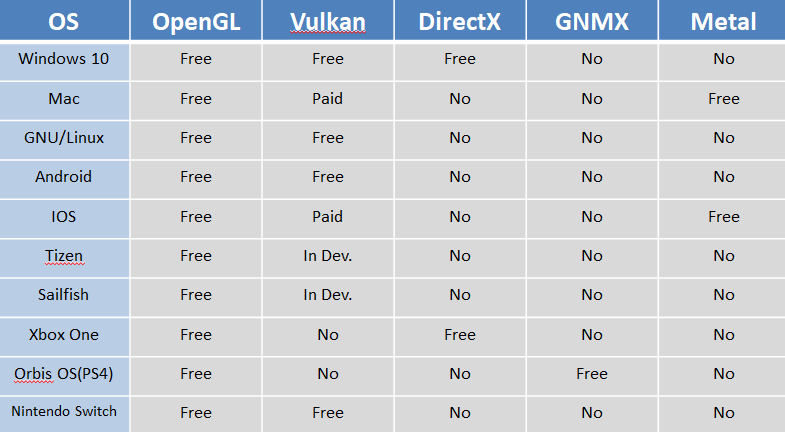

# 電腦圖學與應用

* 圖像即是呈現2D影像，而電腦圖學即是使用電腦利用軟體及硬體產生即顯示2D影像的電腦科學學科。    
 

* 主要研究內容即是在數位化的圖形表示方式、圖形編輯處理演算和圖形顯示相關原理與軟硬體設計，依照即研究內容即方向，可歸納為：
    * 幾何(Geometry)：主要物體的表示與處理方式。

    * 拓樸學(Toplogy)：主要研究空間和表面的結構。

    * 影像生成渲染(Image rendering)：透過演算法將幾何表示繪製出來

    * 影像(Image)：主要研究2D影像的獲取與編輯。

    * 動畫(Animation)：主要研究時域上物體的移動與變化及他們的操作方式。  
 

* 主要應用 ：

    * 數位電影  

    

       
       
    

     

    * 電腦遊戲

    

       
       
    

     

    * 電腦輔助設計(Conputer Aid Design, CAD) 與模擬訓練(Simulation training)

    

       
       
    

     

    * 數位媒體(Digital media)

    

       
       
    

     

    * 圖形化使用者介面(Graphical User Interfaces)

    

       
       
    

     

    * 加強實境(Augmented reality, AR)、虛擬實境(Vitual reality, VR)和混合實境(Mixed reality, MR)

    

       
       
    

     

    * 可視化(Visualization)

    

       
       
    

       
---
   

# 圖學工具包(Graphics Toolkit)

* 圖學工具包(Graphics Toolkit)是為了渲染3D場景再螢幕上生成電腦圖形而設計出來的。    
 

* 市面上有多種圖形工具包(Graphics Toolkit)，一般選用使用合者時，會有以下考量：

    * 功能性(Functionality)  

        * 完整(Throughout)  
        * 小巧(Compact)  
        * 正交(Orthogonal)  
        * 速度(Speed)  

    * 容易使用性(Ease-of-Use)與文件完整性(Documentation)  

    * 可攜性(Portablity)  

    * 可擴張性(Extensibility)  

    * 標準化(Standards)  

    * 擁有性(Ownership)

    

       
    

       
    
 

# OpenGL簡介與歷史

* 開放圖形庫(Open Graphics Library, OPENGL)，是渲染2D與3D幾何物體的跨語言與跨平台的應用程式介面(Application Programming Interface, API)，一般是利用簡單的圖元(Primitive)來繪製複雜的三維場景。  
 

* 歷史
  * OpenGL標準化硬體支援存取方式，硬體製造商開發適當驅動程式，透過底層作頁系統所提供的接口功能，讓不同的圖形硬體可以使用同一種方式去溝通，為開發者提供更高層次的3D軟體開發平台。  
 

* 版本  
  * 2.0版本 : OpenGL 渲染程式語言 1.1 (OpenGL Shading Language, GLSL 1.1) 

  * 主要從3.0版本後開始大量引入GLSL shader renderer.  

  * 目前OpenGL : 4.x版本    

