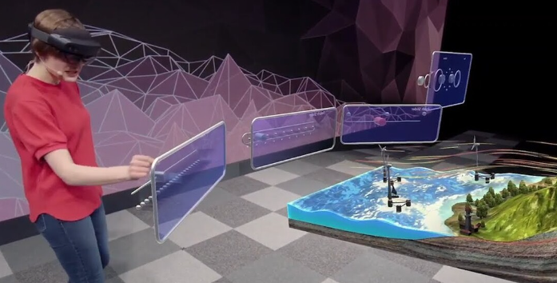

# 電腦圖學與應用

* 圖像即是呈現2D影像，而電腦圖學即是使用電腦利用軟體及硬體產生即顯示2D影像的電腦科學學科。    
 

* 主要研究內容即是在數位化的圖形表示方式、圖形編輯處理演算和圖形顯示相關原理與軟硬體設計，依照即研究內容即方向，可歸納為：
    * 幾何(Geometry)：主要物體的表示與處理方式。

    * 拓樸學(Toplogy)：主要研究空間和表面的結構。

    * 影像生成渲染(Image rendering)：透過演算法將幾何表示繪製出來

    * 影像(Image)：主要研究2D影像的獲取與編輯。

    * 動畫(Animation)：主要研究時域上物體的移動與變化及他們的操作方式。  
 

* 主要應用 ：

    * 數位電影  

    

       
       
    

     

    * 電腦遊戲

    

       
       
    

     

    * 電腦輔助設計(Conputer Aid Design, CAD) 與模擬訓練(Simulation training)

    

       
       
    

     

    * 數位媒體(Digital media)

    

       
       
    

     

    * 圖形化使用者介面(Graphical User Interfaces)

    

       
       
    

     

    * 加強實境(Augmented reality, AR)、虛擬實境(Vitual reality, VR)和混合實境(Mixed reality, MR)

    

       
       
    

     

    * 可視化(Visualization)

    

       
       
    

       
---
   

# 圖學工具包(Graphics Toolkit)

### A third-level heading