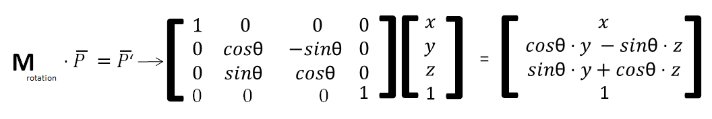
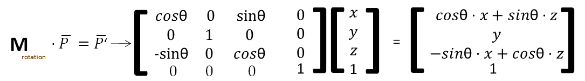
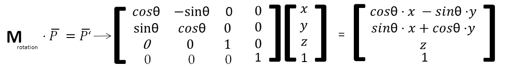

# 座標系統及運算相關表示方法

* 座標(Coordinates)  
    * 用來定義系統中的任一個位置，是構成座標空間的基本要素。
    

       
    

     

* 維度(Dimension)
    * 維度代表在空間中定義一個點最少所需要的座標數量。

    

       
    

     

* 點及位置(Point)
    * 點代表空間中的一個特定位置，並不具備體積、面積或長度，維度為0。  
    * 點的位置可被空間中的對應的一組向量(vector)做座標定義。
    

    

       
    

     

* 向量(Vector)
    * 向量(Vector)代表一組距有順序排序的一串數組，數組中的數字可用整數定位(向量中的第n個數)。
    

       
    
  
     

* 方向(Direction)
    * 方向代表空間中兩個點的相對位置信息，不具有起點、終點、與長度的信息，並注重空間中的相對性。
    

       
    
    
     
    
* 矩陣(Matrix)
    * 矩陣是一個由二為數組組成的數學系統。  
    

       
    
    
     

* 座標系統(Coordinate System)
    * 座標系統(Coordinate System)是在一個n維度的座標空間(coordinate space)。  
    

       
    
    
     

---
    
# 基本數學與空間運算

* 數學記號與常用變數  
    * 用來定義系統中的任一個位置，是構成座標空間的基本要素。  
    

       
    
    
     

    

       
    
    
       

* 向量相關數學運算  

   向量在空間中可視為一個點，或是兩點之間的距離，這樣的特性使的向量能夠幫助計算空間中的問題。  
      

   * 向量間的疊加(Addition)  
     * 向量的疊加可視為移動量的疊加

   * 向量與純量之間的乘除法(Multiplication)  
     * 向量具有長度的性質，與純量做成除法的運算，可改變長度的大小並保留其方向的特性。  

   * 向量間的內積(Dot product)
     * 向量在空間中的內積具有許多特質可幫助求得向量間的角度關係與分量大小。  
     * 其向量之間的內積定義是將兩邊向量的對應項次之乘積累加。  

   * 向量間的叉積(Cross product)
     * 叉積(Cross product)，或稱向量積(Cross product)，是用來求得與兩向量垂直的向量方向。

* 矩陣相關數學運算  

   矩陣是一個由二維數組組成的數學系統，其許多的數學特性使其用於解線性方程組或是計算線性變換上時常用到。  

   * 基本性質與基本運算  
     * 矩陣中的元素數量有 m X n 個，且每個元素能夠被標註其位置。  

   * 矩陣加法運算(Addition)  
     * 兩個**大小相同**的兩個矩陣之間可以相加。  

   * 矩陣與純量乘法運算(Multiplication)  
     * 矩陣可以與純量相乘。  

   * 矩陣轉置運算(Matrix transpose)  
     * 矩陣本身可以做轉置運算，其大小從 m X n -> n X m。  

   * 矩陣運算性質  
     * 矩陣的加法運算滿足交換率(Commutative property)   
       * A + B = B + A  
     * 矩陣的轉置和純量乘法運算對加法滿足分配律(Distributive property)  
       * (A + B)T = AT + BT  
       * n(A + B) = nA + nB  
     * 純量乘法與轉置的順具可以互換
       * n(AT) = (nA)T  

   * 矩陣間的乘法(Multiplication)  
     * 兩個矩陣的乘法僅當地一個矩陣A的行數和另一個矩陣B的列數**相等**時，才能定義。  
       * Amxn . Bnxp = Cmxp  
     * 矩陣的乘法滿足結合律和對矩陣加法的分配律(Distributive property)  
       * (AB)C = A(BC)  
       * (A+B)C = AC + BC  
       * C(A+B) = CA + CB  
     * 矩陣的乘法與純量乘法運算和轉置也滿足以下轉換  
       * c(AB) = (cA)B = A(cB)
       * (AB)T = BTAT  
     * **矩陣乘法不滿足交換律**  
       * **AB ≠ BA**  

   * 方正矩陣與逆矩陣(Square matrix & Inverse matrix)  
     * 當一個矩陣的行數與列數相等，可將該矩陣稱為方正矩陣(Square matrix)。  
     * 一個 n X n 的方正矩陣A，若存在另一格方陣矩陣B使得 AB = ln = BA，則A為**可逆矩陣(Invertible matrix)**，而B為A的反矩陣(Inversion matrix)，且可將B記為A-1。  
     * 逆矩陣(Inverse matrix)再用於解線性方程式或是用於反轉換運算等數學領域都有用途。  
       * ex :   
        Ax = b  
        A-1Ax = A-1b  
        lnx = A-1b  
        x = A-1b  
     * 當物體透過變化矩陣(Transformation matrix) **A** 從 P -> P'，該物體也可透過 **A** 的反矩陣(Inversion matrix) 從 P' -> P。  

      
   

       
   
    
      

---
    
# 座標系統和轉換

在鏡頭投影系統中，世界空間、相機和物體到螢幕都有屬於自己的座標空間，要正確地將物體投影回螢幕就必須經過座標系統的轉換，才能將物體渲染在螢幕上正確的位置。

       

    
在空間中，相同的位置在不同的座標系統下，標示的方式也不同。  
  
   

       

 
在空間中相同的位置在不同的座標系統下標示的結果也不同。  
  
  

在三維空間中，要將位置轉換至不同的座標空間內，需要進行座標轉換的運算，而在轉換前會將物體的座標轉變為三維齊次座標(3D homogeneous coordinate)表示。

       

 
三維的齊次座標用(x, y, z, h)四元素向量表示在直角坐標空間中( x/h, y/h, z/h)的位置。  

當h為零時，表示物體在(x, y, z)方向中無限遠的位置。

  
  

       

 
在齊次座標空間中，物體的座標轉換可透過變化矩陣(Transformation matrix)運算達成。

   

* 位移轉換(Translation Transformation)  

  當需要把再三維空間中的物體，從現在的座標系統表示轉換到另一個相對空間位移的座標系表示，或是需要將物體在空間中移動時，需要進行位移轉換。

  

       
  
 

     

* 旋轉轉換(Rotation Transformation)  

  當需要把再三維空間中的物體從現在的座標系統表是轉換到另一個相對旋轉的座標系表示，或是需要將物體在空間中繞著座標軸時，需要進行旋轉轉換。

  

       
  
 
  沿著 x 軸旋轉θ。到新位置

     

  

       
  
 
  沿著 y 軸旋轉θ。到新位置

     

  

       
  
 
  沿著 z 軸旋轉θ。到新位置

     

  **因其運算並不具有交換律的性質，所以三個軸向的旋轉順序不同會導致旋轉結果不同。**  

* 縮放轉換(Scaling Transformation)  

  當需要把再三維空間中的物體從現在的座標系統表示轉換到另一個相對縮放的座標系表示，或是需要將物體在空間中沿著座標軸縮放與原典的距離時，就需要進行縮放轉換。

   

       
  
  
     

  當縮放的參數為負值時，會產生翻轉的效果，稱為反射轉換(Reflection transform)、鏡射轉換(Mirror transform)和翻轉轉換(Flip transform)。  

   

       
  
 
     

  
  

       
  
  

  點(x, y, z)對X座標軸反射到新位置  

      
  
  

       
  
  

  點(x, y, z)對X與Z座標軸反射到新位置  

     

* 切變轉換(Shearing Transformation)  

  切變(Shearing)，是指將座標系統中座標軸之間的關係根據空間平面中指定的方向而改變，當在空間的點與指定方向(經原點)的距離越遠時，改變的程度就越大。  

  當需要把在三維空間中的物體從現在的座標系統表示轉換到另一個相對切變(Shearing)的座標系表示，或是需要將物體在空間中隨著指定平面方向扭曲時就需要進行切變轉換。

  在三維空間中，進行切變轉換(Shearing transformation)時需要的平面方向會從二維空間需要的一個增加為三個(x-y plane, x-z plane, y-z plane)。

  

       
  
  
  
     

* 透視轉換(Perspective Transformation)

  當鏡頭產生的視錐區域對應到二維平面時，較遠的物體被壓縮，透過透視轉換(Perspective Transformation)運算可以計算此笑我，將處在三維空間中離座標原點的越遠的位置縮放的越小。  

  

       
  
  
  當點(x, y, z)位置的物體對(X, Y, Z)進行透視轉換到新位置時。  

     

* 綜合轉換(Combination Transformation)

  旋轉、縮放與位移，這三個運算會影響物體所處的座標軸，若是轉換順序不一樣，得到的結果也會不相同，建議先將物體轉回座標原點再進行旋轉與縮放的運算。

---
    
# 座標系統和轉換

在OpenGL中有透視投影(Perspective projection)與正交投影(Orthographic projection)兩種鏡頭設定。 

      

  
   

透視投影(Perspective projection)透過設定鏡頭的廣角與投影面長寬比投影出類似於第一人稱視角的畫面。  
正交投影(Orthographic projection)透過設定投影的方向與平面，投影出模擬從遠方觀察的畫面，

* 透視投影(Perspective projection)  

  透視投影(Perspective projection)的成像結果較接近用相機拍攝環境的效果，比較能察覺環境的深度。

  

        
  
  
     

  

        
  
  
     

  經過轉換後，無論原位置的深度Z為何值，其運算的結果皆會使新位置的深度為d，使的空間中的物體都壓縮對應到 (z=d) 的二維平面上。  

* 正交投影(Orthographic projection)

  正交投影(Orthographic projection)的成像結果常用在鳥瞰視野或是截面圖上，對單一平面上的觀察較為精確。

  

        
  
  
     

  

        
  
  
     

  經過轉換後，無論原位置的深度Z為何值，其運算的結果皆會使新位置的深度為0，使的空間中的物體都壓縮對應到 (z=0) 的二維平面上。  

---
    
# 渲染相關座標系統

  

