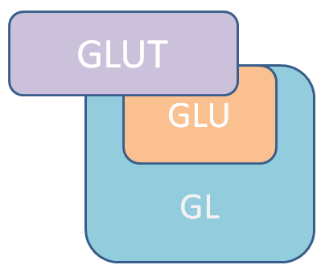
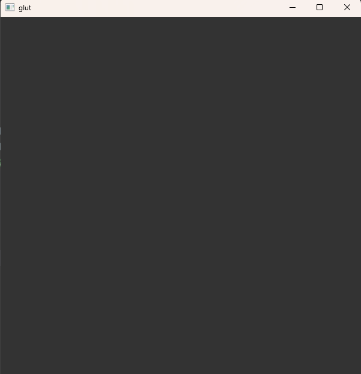
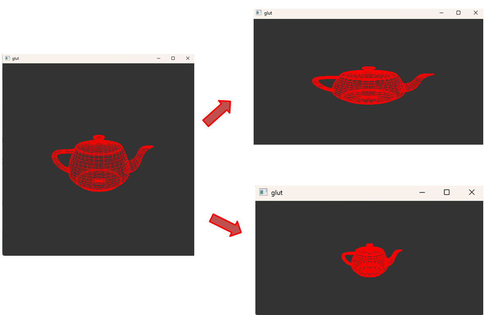

# Window應用程式介面(API)及3D繪圖

設計者想設計應用程式，並在程式的視窗內進行3D繪圖，需要兩種應用程式介面(API)。  

1. 視窗程式的應用程式介面(API)  

   視窗程式，即是圖形使用者介面(Graphical User Interface, GUI)的應用程式單位，設計者能在視窗程式中，獲得使用者與應用程式互動的資訊，以此進行渲染，將程式的內部資料視覺化於使用者前。

2. 繪圖程式的應用程式介面(API)  

   亦稱繪圖函式庫(Graphics Library)，藉由函式庫便能利用電腦產生圖像，也就是電腦繪圖(Computer Graphics, CG)技術。

設計者適當的呼叫這兩種應用程式介面的指令後，便能將想畫出的圖像，通過程式編寫，在應用程式的視窗上進行渲染，將資訊呈現於螢幕上。

**而GLUT則同時實作了兩種應用程式介面。**


* Window API   
  
  由於各種作業系統下所提供的視窗應用程式介面不同，設計者所撰寫出的程式，往往在不同的作業系統下便無法正確的運行，**GLUT是跨平台的API**，提供在不同的作業系統下，仍然能正確的運營。  

* 3D繪圖  

  OpenGL核心庫(GL)為OpenGL提供的最基本函式庫，GLU經由GL實作了一些常用功能的函式，GLUT則多提供了立體圖形的繪製函式，並且也提供了其他功能。

  <div style="display: flex; justify-content: space-around;">
      
  </div>
  <br/>

---
    
# GLUT簡介  

GLUT的功能包刮：定意視窗、視窗控制、接受鍵盤滑鼠的輸入、渲染程式到螢幕上、繪製幾何行元體...等。

由於GLUT本身並非開源軟體，現今所用的函式庫幾乎都是freeglut，是由其他程式設計師所重新製作的開源的OpenGL應用程式介面(API)。

* 環境建置

  我參考了  
  https://www.youtube.com/watch?v=A1LqGsyl3C4&ab_channel=TechLearners  
  建立了本地的環境，可以參考自己的電腦配置來找出適合自己的環境建立。  
  <br/>

---  

# GLUT介面程式實作

現在進行程式的撰寫，將測試並視覺化GLUT的功能，總共四個過程：  
1. **視窗建立**  

   視窗建立是使用GLUT的第一步驟，由於GLUT預設必須要有渲染的函式，否則無法正確運行，因此，此節先會先將渲染功能註冊後，讓程式進行更新，並且清除畫面。

    ``` cpp
    // windowCreate.cpp  

    int main(int argc, char *argv[])
    {
      // 初始化GLUT函式庫
      glutInit(&argc, argv);  
      // 初始化渲染模式，並指定緩存器類型 (for windows)
      glutInitDisplayMode(GLUT_RGBA | GLUT_DOUBLE | GLUT_DEPTH); 
      // 初始化視窗位置，(0, 0)為屏幕的左上角
      glutInitWindowPosition(100, 100);
      // 初始化視窗長寬
      glutInitWindowSize(600, 600);  
      // 創立一個標題為'glut'的視窗
      glutCreateWindow("glut");
      // 設定清除畫面為指定顏色
      glClearColor(0.2f, 0.2f, 0.2f, 1.0f);

      // 註冊設計者的繪圖函式進入GLUT
      glutDisplayFunc(My_Display);

      // 迴圈指令，讓GLUT創建出的視窗不斷運行
      glutMainLoop();
    }
    ```  

    ``` cpp
    // windowCreate.cpp

    // 註冊繪圖函式
    void My_Display()
    {
      // 清除畫面儲存的顏色緩存器，以及深度緩存器
      glClear(GL_COLOR_BUFFER_BIT | GL_DEPTH_BUFFER_BIT);  
      // 將畫面清除為設定的顏色
      glClearColor(0.2f, 0.2f, 0.2f, 1.0f);  
      // 交替被現在使用的緩存器及後緩存器，可避免螢幕閃爍
      glutSwapBuffers();
    }
    ```  

    <div style="display: flex; ">
        
    </div>
    <br/>


2. 利用**渲染功能繪製茶壺**  

    第二章介紹了基本數學相機與投影、矩陣運算的方法，這些再OpenGL已完成實作，只需要再編寫程式碼時，注意呼叫函式時對OpenGL的影響，便能進行3D繪圖。

    視窗的長寬可能會因為使用者的操控而改變，可在主函式下新增註冊視窗重塑函式，並在視窗重塑函式下，計算3D繪圖需要的投影矩陣(Projection matrix)，同時再渲染函式計算模塑座標矩陣(Model matrix)、以及視覽座標矩陣(View matrix)，變成正確進行繪圖。

    <div style="display: flex; ">
        
    </div>
    <br/>

    ``` cpp
    // teapotRender.cpp  

    int main(int argc, char *argv[])
    {
      // ... (Original code)

      // 註冊設計者的繪圖函式進入GLUT
      glutDisplayFunc(My_Display);
      // 註冊當視窗大小改變時的回應函數
      glutReshapeFunc(My_Reshape)

      // ... (Original code)
    }
    ```  

    ``` cpp
    // teapotRender.cpp  

    void My_Reshape(int width, int height)
    {
      // 視口(Viewport)的寬高比，避免圖形拉伸或壓縮、保持視覺一致性
      float aspect = static_cast<float>(width) / static_cast<float>(height);
      // 指定目前運算的矩陣為投影矩陣(Projection matrix)
      glMatrixMode(GL_PROJECTION);
      // 將目前指定的矩陣重設為單位矩陣
      glLoadIdentity();
      // 視口(Viewport)設定，能將投影的影像對應在視窗座標上
      glViewport(0, 0, width, height);
      // 投影模式為透視(Perspective)，並設定其參數
      gluPerspective(60.0f, aspect, 0.1f, 10.0f);
    }
    
    ```  
    投影矩陣設定完，便要設定模塑座標矩陣(Model matrix)及視覽座標矩陣(View matrix)，OpenGL將兩個矩陣綁再一起，因此，若要在渲染函式下進行相機設定，僅需使用glutLookAt函式，便能完成視覽矩陣的設定(View matrix)，**此節先不做模塑座標矩陣(Model matrix)的改變**，而直接將茶壺畫出。
    ``` cpp
    // teapotRender.cpp 

    void My_Disaply()
    {
      // 清除畫面儲存的顏色緩存器，以及深度緩存器
      glClear(GL_COLOR_BUFFER_BIT | GL_DEPTH_BUFFER_BIT);

      // 指定目前運算的矩陣為視覽座標矩陣及模塑座標矩陣
      glMatrixMode(GL_MODELVIEW);
      // 將目前指定的矩陣重設為單位矩陣
      glLoadIdentity();
      // 設定相機的位置、視點、y軸向量
      gluLookAt(0.0, 2.0, 5.0,
                0.0, 0.0, 0.0,
                0.0, 1.0, 0.0);
      // 指定目前所使用的顏色
      glColor3b(125, 0, 0);

      // 劃出線框茶壺
      glutWireTeapot(1);

      // 交替被現在使用的緩存器及後緩存器，可避免螢幕閃爍
      glutSwapBuffers();
    }
    ```  


3. 利用**計時功能使茶壺旋轉**、**按鍵功能進行位移**、**選單功能進行茶壺大小選擇**  
    
    再3D繪圖中，通常藉由模塑座標矩陣(Model matrix)，儲存一個模型的位置、旋轉、以及縮放大小，因此，只需要對該矩陣進行運算，便能使模型做變化(Transform)。

    此節分別利用GLUT的鍵盤事件、計時器功能、彈出式選單功能，來改變模塑座標矩陣(Model matrix)，將模型做變化。

    首先，在主程式上註冊對應的函式後，並在渲染功能下增加模塑座標矩陣(Model matrix)運算，再通過其他回應函數(Callback function)輔助後，將所使用的變數變化後，便能完成功能。

    ``` cpp
    // transform.cpp  

    int main(int argc, char *argv[])
    {
      // ... (Original code)

      // 註冊設計者的繪圖函式進入GLUT
      glutDisplayFunc(My_Display);
      // 註冊當視窗大小改變時的回應函數
      glutReshapeFunc(My_Reshape)
      // 註冊當鍵盤字元鍵輸入時的回應函數
      glutKeyboardFunc(My_Keyboard);
      // 註冊當鍵盤功能鍵輸入時的回應函數
      glutSpecialFunc(My_SpecialKeys);
      // 註冊當程式經過指定時間時的回應函數
      glutTimerFunc(timer_interval, My_Timer, 0);

      // ... (Original code)
    }
    ```  

    選單功能的選單結構需要使用者定義，同樣再主程式下定義選單，並回應函數註冊在選單上。

    ``` cpp
    // transform.cpp  

    int main(int argc, char *argv[])
    {
      // ... (Original code)

      // 建立空的選單
      int menu_main = glutCreateMenu(My_Menu);
      int menu_entry = glutCreateMenu(My_Menu);
      // 設定目前指定的選單 -> menu_main
      glutSetMenu(menu_main);
      // 增設子選單至目前選單，子選單為menu_entry，
      glutAddSubMenu("Teapot Size", menu_entry);
      // 增設選項至目前選項，並給予名稱、辨識用的值
      glutAddMenuEntry("Exit", MENU_EXIT);
      // 設定目前指定的選單 -> menu_entry
      glutSetMenu(menu_entry);
      // 增設選項至目前選項，並給予名稱、辨識用的值
      glutAddMenuEntry("1.0", SIZE_1);
      glutAddMenuEntry("2.0", SIZE_2);
      // 設定目前指定的選單 -> menu_main
      glutSetMenu(menu_main);
      // 將目前選單 -> 設為右鍵按下時觸發彈出
      glutAttachMenu(GLUT_RIGHT_BUTTON);

      // ... (Original code)
    }
    ```  

    註冊回應函數(Callback function)後，必須實作各個回應函數(Callback function)，並且針對模塑座標矩陣(Model matrix)進行計算，使得茶壺進行變化(Transform)。  

    宣告提供給模塑座標矩陣(Model matrix)計算、以及回應函數(Callback function)會使用到的變數。  

    ``` cpp
    // transform.cpp  

    #include <GL/glut.h>
    #include <string>  

    // 調整茶壺顏色
    std::string myColor = "Blue";
    // 調整茶壺X軸、Y軸位置
    float teapot_posX = 0.0f;
    float teapot_posY = 0.0f;
    // 調整茶壺大小
    float teapot_size = 1.0f;

    // 定時器間隔設置為1000毫秒，表示每0.1秒鐘執行一次
    const int timer_interval = 100;
    // 旋轉角度，會隨時間做更動
    float rotateAngle = 0.0f;
    // 旋轉速度，假設每0.1秒旋轉30度
    float rotateSpeed = 30.0f;

    // 提供給選單的標示符
    const int SIZE_1 = 1;
    const int SIZE_2 = 2;
    const int MENU_EXIT = 3;  

    // ... (Original code)
    ```   

    針對模塑座標矩陣(Model matrix)進行計算，包含移動、旋轉、顏色的調整。

    ``` cpp
    // transform.cpp  

    void My_Display()
    {
      // ... (Original code)

      // 指定目前運算的矩陣為視覽座標矩陣及模塑座標矩陣
      glMatrixMode(GL_MODELVIEW);

      // ... (Original code)

      gluLookAt(0.0, 2.0, 5.0,
          0.0, 0.0, 0.0,
          0.0, 1.0, 0.0);

      // 將目前的矩陣乘上位移矩陣
      glTranslatef(teapot_posX, teapot_posY, 0.0f);
      // 將目前的矩陣乘上旋轉矩陣
      glRotatef(rotateAngle, 0.0f, 1.0f, 0.0f);
      // 變更茶壺的大小
      glScalef(teapot_size, teapot_size, teapot_size);
      // 設定目前使用的顏色
      if (myColor == "Red")
      {
        glColor3b(125, 0, 0);
      }
      else if (myColor == "Green")
      {
        glColor3b(0, 125, 0);
      }
      else if (myColor == "Blue")
      {
        glColor3b(0, 0, 125);
      }

      glutWireTeapot(1);

      glutSwapBuffers();
    }
    ```  

    實作利用計時器旋轉茶壺的功能。  

    ``` cpp
    // transform.cpp  

    void My_Timer(int val)
    {
      // 使程式即時更新畫面
      glutPostRedisplay();

      glutTimerFunc(timer_interval, My_Timer, val);
      // 根據時間和速度計算並累積旋轉量
      rotateAngle += rotateSpeed * timer_interval * 0.001;
    }
    ```  

    實作利用鍵盤字元事件完成茶壺位移的功能。

    ``` cpp
    // transform.cpp  

    void My_Keyboard(unsigned char key, int x, int y)
    {
      // 當取得字元key為'W'或'w'時
      if (key == 'W' || key == 'w')
      {
        // 茶壺位置的y軸位置值增加
        teapot_posY += 0.05f;
      }
      else if (key == 'S' || key == 's')
      {
        teapot_posY -= 0.05f;
      }
      else if (key == 'A' || key == 'a')
      {
        teapot_posX -= 0.05f;
      }
      else if (key == 'D' || key == 'd')
      {
        teapot_posX += 0.05f;
      }
    }
    ```  

    鍵盤功能鍵與鍵盤字元鍵不同，需要利用GLUT所定義的按鍵值，才可以讓程式知道輸入的按鍵。  
    實作利用鍵盤功能鍵事件完成改變茶壺顏色的功能。  

    ``` cpp
    // transform.cpp  

    void My_SpecialKeys(int key, int x, int y)
    {
      // 當取得字鍵值key，對應鍵盤F1時
      if (key == GLUT_KEY_F1)
      {
        // 顏色變數改為紅色
        myColor = "Red";
      }
      else if (key == GLUT_KEY_F2)
      {
        myColor = "Green";
      }
      if (key == GLUT_KEY_F3)
      {
        myColor = "Blue";
      }
    }
    ```  

    最後，選單功能，在主函式所定義的選單結構下，每個條目將會給予一個辨識值，即，程式在選單條目被選取時，接收的整數值將會對應當初所設定的辨識值，來完成功能上對應的調整。  

    實作選單功能，用以改變茶壺大小。

    ``` cpp
    // transform.cpp  

    void My_Menu(int id)
    {
      // 利用接收的值，判別被選擇的條目
      if (id == SIZE_1)
      {
        // 更改茶壺大小
        teapot_size = 1.0f;
      }
      else if (id == SIZE_2)
      {
        teapot_size = 2.0f;
      }
      else if (id == MENU_EXIT)
      {
        exit(0);
      }
    }
    ```  

4. **滑鼠事件調變背景顏色**  
    
    滑鼠事件，使用者常常利用滑鼠在應用程式裡，進行點擊、拖曳等等動作。  

    在此節，將通過滑鼠事件和利用變數值調整 glClearColor 函式，來完成背景顏色的改變。  

    首先，在主程式上註冊滑鼠事件的回應函數(Callback function)，並在滑鼠點擊時，繼續當下的滑鼠座標及背景明暗度，接著利用滑鼠拖曳時計算被拖曳的向量差，便能透過計算得到相應的背景明暗度。

    ``` cpp
    // mouseEvent.cpp  

    int main(int argc, char *argv[])
    {
      // ... (Original code)

      // 註冊設計者的繪圖函式進入GLUT
      glutDisplayFunc(My_Display);
      // 註冊當視窗大小改變時的回應函數
      glutReshapeFunc(My_Reshape)
      // 註冊滑鼠按鍵的回應函數(Callback function)
      glutMouseFunc(My_Mouse);
      // 註冊滑鼠拖曳時的回應函數(Callback function)
      glutMotionFunc(Mouse_Moving);

      // ... (Original code)
    }
    ```  

    宣告提供給回應函數(Callback function)會使用到的變數、以及背景改變時 glClearColor 會使用到的變數。  

    ``` cpp
    // mouseEvent.cpp  

    #include <GL/glut.h>
    #include <string>

    // 假設初始背景顏色為灰色
    float oldbackGray = 0.2f; 
    // 初始背景顏色
    float backgroundGray = 0.2f;
    // 使用者按下滑鼠左鍵時，記錄下按下瞬間的滑鼠 x 座標
    int clickPt_x = 0;
    ```  

    實作滑鼠按鍵的回應函數。  

    ``` cpp
    // mouseEvent.cpp  
    
    // 滑鼠按鍵事件，判斷目前左鍵狀態為點擊
    void My_Mouse(int button, int state, int x, int y)
    {
      // 取得的按鍵為滑鼠左鍵
      if (button == GLUT_LEFT_BUTTON)
      {
        // 按鍵狀態為點擊的時的瞬間
        if (state == GLUT_DOWN)
        {
          // 儲存當下的背景明暗度
          oldbackGray = backgroundGray;
          // 儲存當下x軸的滑鼠位置
          clickPt_x = x;
        }
      }
    }
    ```  

    實作滑鼠拖曳事件，取得滑鼠點擊中，且按鍵未放開時的滑鼠座標，利用該座標算出新的背景明暗度。  

    ``` cpp
    // mouseEvent.cpp  
    
    // 滑鼠拖曳事件，藉由拖曳向量，改變背景明亮度
    void Mouse_Moving(int x, int y)
    {
      // 根據 滑鼠移動到的座標 與 點擊時的座標 之間的向量差，改變背景明亮度
      backgroundGray = (x - clickPt_x) * 0.005f + oldbackGray;
      // 避免計算值超過範圍
      backgroundGray = std::min(std::max(backgroundGray, 0.0f), 1.0f);

      // 藉由獲取的 backgroundGray 值，改變背景顏色
      glClearColor(backgroundGray, backgroundGray, backgroundGray, 1.0f);
      // 使程式即時更新畫面
      glutPostRedisplay();
    }
    ```  


